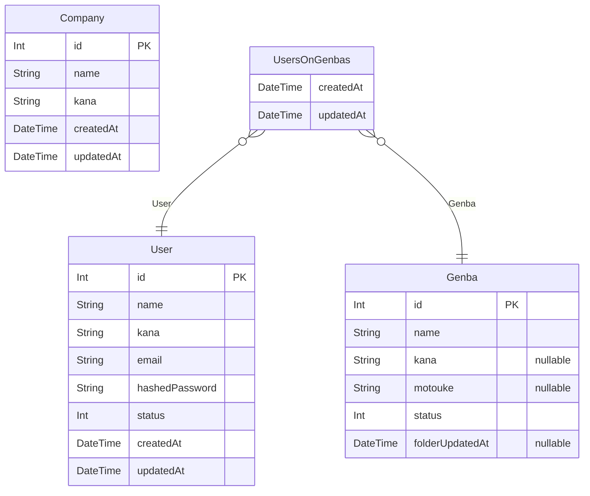

```mermaid
erDiagram

  User {
    Int id PK 
    String name  
    String kana  
    String email  
    String hashedPassword  
    Int status  
    DateTime createdAt  
    DateTime updatedAt  
    }
  

  Genba {
    Int id PK 
    String name  
    String kana  "nullable"
    String motouke  "nullable"
    Int status  
    DateTime folderUpdatedAt  "nullable"
    }
  

  Company {
    Int id PK 
    String name  
    String kana  
    DateTime createdAt  
    DateTime updatedAt  
    }
  

  UsersOnGenbas {
    DateTime createdAt  
    DateTime updatedAt  
    }
  
    UsersOnGenbas o{--|| User : "User"
    UsersOnGenbas o{--|| Genba : "Genba"
```
